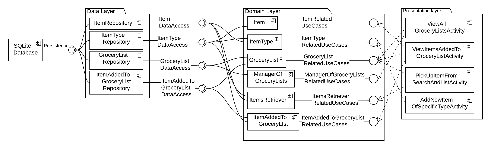

# Design Document

**Author**: Team95

## 1 Design Considerations

We have made some assumptions about the system environment based on the requirements given to us for creating the application and discussions among the team members.

### 1.1 Assumptions

1. The application is going to be used on a smartphone with Android operating system.
2. The application is going to store its data on the device only. There is no data retrieval, backup or synchronization to be performed on remote server.
3. There is no authentication functionality present in the app. The app is assumed to be used without the user performing 'Sign up' or 'Sign in' operations.

### 1.2 Constraints

1. As the application is going to be used on a smartphone, the interactions with the app are going to be driven through touches and gestures of user on the touch screen.
2. The size of the screen is small as compared to desktop applications. Therefore the User Interface has to be designed carefully in format optimized for mobile to enable the user for conveniently using in the app. 

### 1.3 System Environment

1. The application will be run on smartphones and tablets having Android operating system.
2. The minimum Android OS version of the smartphone on which the application can be installed and run is 4.0.3 Ice Cream Sandwich. 

## 2 Architectural Design

In this application, we are following [Model View Presenter](https://en.wikipedia.org/wiki/Model%E2%80%93view%E2%80%93presenter "MVP explained on Wikipedia") pattern with [Clean Architecture](https://8thlight.com/blog/uncle-bob/2012/08/13/the-clean-architecture.html "Original article explaining Clean Architecture") style for design of the system. The MVP pattern is suitable for creating User Interface of application and the Clean Architecture approach emphasizes on separation of concerns between different layers of the application and mandates a direction of dependencies between components from different layers of the system for ease of maintainability and testability of the system. Clean Architecture style led us to add a layer called Domain in middle of two layers namely Data layer and Presentation layer. Domain layer takes care of implementing the use cases served by the application. We have described the architecture thorugh component digaram in following section. 

### 2.1 Component Diagram

The components of the system are organized in three logical layers namely: Data layer, Domain layer and Presentation layer. All the methods implementing the database queries will be present in the repository components in Data layer. The logic of the use cases of the application will be implemented by the components included the Domain layer. The User Interface of the application will be managed by activity components shown in the Presentation layer. The annotated connections between the components show the interfaces provided and required by the corresponding components.

### 2.2 Deployment Diagram

For this application, we are going to deploy the all the components of the system on single device (like smartphone or tablet). The system doesn't rely on remote server for any of its functionalities. Therefore we have chosen not to create a deployment diagram for this system.

## 3 Low-Level Design

*Describe the low-level design for each of the system components identified in the previous section. For each component, you should provide details in the following UML diagrams to show its internal structure.*

### 3.1 Class Diagram

*In the case of an OO design, the internal structure of a software component would typically be expressed as a UML class diagram that represents the static class structure for the component and their relationships.*

### 3.2 Other Diagrams

*<u>Optionally</u>, you can decide to describe some dynamic aspects of your system using one or more behavioral diagrams, such as sequence and state diagrams.*

## 4 User Interface Design
*For GUI-based systems, this section should provide the specific format/layout of the user interface of the system (e.g., in the form of graphical mockups).*

